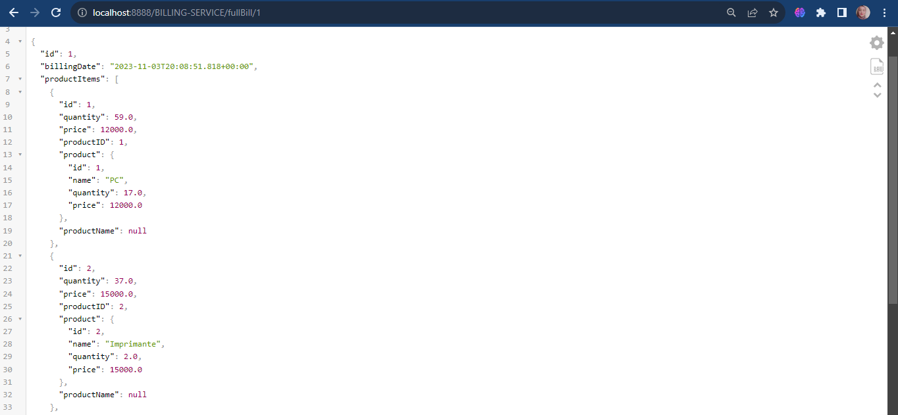

# Activité pratique N°2 : Architectures Micro-services avec Spring cloud

## Table de matières
### Partie 1:
- [Customer-Service](#customer-service)
- [Inventory-Service](#inventory-service)
- [Spring Cloud Gateway](#spring-cloud-gateway)
- [Eureka Discovery](#eureka-discovery)

### Partie 2:
- [Billing Service avec Open Feign Rest Client](#billing-service-avec-open-feign-rest-client)

### Partie front
- [E-com-app-Front](#front)


## Architecture


## Customer-Service

L'entité "Customer" comporte les propriétés suivantes :
* id
* email
* nom

```java
  public class Customer {
    @Id
    @GeneratedValue(strategy = GenerationType.IDENTITY)
    private Long id;
    private String name;
    private String email;
  }
```
CustomerRepository

```java
    @RepositoryRestResource
    public interface CustomerRepository extends JpaRepository<Customer,Long> {
    }
```
## Récuperer les customers

## Récuperer un customer par son id


## Inventory-Service
L'entité "Product" comporte les propriétés suivantes :
* id
* name
* price
* quantity

```java
  public class Product {
    @Id
    @GeneratedValue(strategy = GenerationType.IDENTITY)
    private Long id;
    private String name;
    private double price;
    private int quantity;
  }
```
ProductRepository

```java
    @RepositoryRestResource
    public interface ProductRepository extends JpaRepository<Product,Long> {
    }
```
## Récuperer les products

## Récuperer un product par son id


## Spring Cloud Gateway
Spring Cloud Gateway vise à fournir une API efficace pour créer des
passerelles dans les microservices.

1. Configuration statistique de Spring Cloud Gateway basée sur appliation.yml

```yaml
      spring:
        cloud:
          gateway:
            routes:
              - id: r1
                uri: http://localhost:8085/
                predicates:
                  - Path=/customers/**
              - id: r2
                uri: http://localhost:8086/
                predicates:
                  - Path=/products/**
```
2. Configuration dynamique en java de Spring Cloud Gateway

```java
    @Bean
    DiscoveryClientRouteDefinitionLocator definitionLocator(
            ReactiveDiscoveryClient discoveryClient,
            DiscoveryLocatorProperties properties) {
        return new DiscoveryClientRouteDefinitionLocator(discoveryClient, properties);
    }
```
## Eureka Discovery
Eureka est un service de découverte de registre dans une architecture de microservices, ce qui permet aux services de localiser et de communiquer entre eux de manière dynamique.

* dependence à ajouter dans pom.xml

```xml
  <dependency>
    <groupId>org.springframework.cloud</groupId>
    <artifactId>spring-cloud-starter-netflix-eureka-server</artifactId>
  </dependency>
```


## Billing Service avec Open Feign Rest Client
OpenFeign est un client REST pour Java. Il facilite l'écriture de clients REST. Il utilise la bibliothèque Jackson pour
la sérialisation et la désérialisation des données JSON.

* dependence à ajouter dans pom.xml

```xml
  <dependency>
    <groupId>org.springframework.cloud</groupId>
    <artifactId>spring-cloud-starter-openfeign</artifactId>
  </dependency>
```
* Bill entity

```java
  @Entity
  @Data @NoArgsConstructor
  @AllArgsConstructor
  public class Bill {
  @Id @GeneratedValue(strategy = GenerationType.IDENTITY)
  private Long id;
  private Date billingDate;
  @OneToMany(mappedBy = "bill")
  private Collection<ProductItem> productItems;
  private Long customerId;
  @Transient
  private Customer customer;
  }
```
* ProductItem entity

```java
  @Entity
  @Data @NoArgsConstructor @AllArgsConstructor
  public class ProductItem {
  @Id @GeneratedValue(strategy = GenerationType.IDENTITY)
  private Long id;
  private double quantity;
  private double price;
  private Long productId;
  @JsonProperty(access = JsonProperty.Access.WRITE_ONLY)
  @ManyToOne
  private Bill bill;
  @Transient
  private Product product;
  @Transient
  private  String productName;
  }
```
* BillRepository

```java 
  public interface BillRepository extends JpaRepository<Bill, Long> {
  @RestResource(path = "/byCustomerId")
  List<Bill> findByCustomerID(@Param("customerId") Long customerId);
  }
```
* ProductItemRepository
    
```java 
  public interface ProductItemRepository extends JpaRepository<ProductItem, Long> {
  public Collection<ProductItem> findById(long id);
  }
```
* CustomerRestClient

```java
  @FeignClient(name = "CUSTOMER-SERVICE")
  public interface CustomerRestClient {
  @GetMapping(path = "/customers/{id}")
  Customer getCustomerById(@PathVariable(name = "id") Long id);
  }
```
* ProductItemRestClient
```java
  @FeignClient(name = "PRODUCT-SERVICE")
  public interface ProductItemRestClient {
  @GetMapping(path = "/products")
  PagedModel<Product> pageProducts(@RequestParam(name = "page") int page, @RequestParam(name = "size") int size);
  @GetMapping(path = "/products")
  PagedModel<Product> pageProducts();
  @GetMapping(path = "/products/{id}")
  Product getProductById(@PathVariable Long id);
  }
```
* BillRestController
```java
  @GetMapping(path = "/fullBill/{id}")
  public Bill getBill(@PathVariable(name = "id") Long id) {
  Bill bill = billRepository.findById(id).get();
  bill.setCustomer(customerRestClient.getCustomerById(bill.getCustomerID()));
  bill.getProductItems().forEach(
  productItem -> {
  Product product = productItemRestClient.getProductById(productItem.getProductID());
  productItem.setProduct(product);}
  );
  return bill;
  }
```




## Front
lien du repo front : https://github.com/DOUHIChaimae/ecom-web-app:  

* Customers: 


* Products:


* Customer orders:


* Order details:


  

## 🔗 About me :

[](https://www.linkedin.com/in/chaimae-douhi/)

